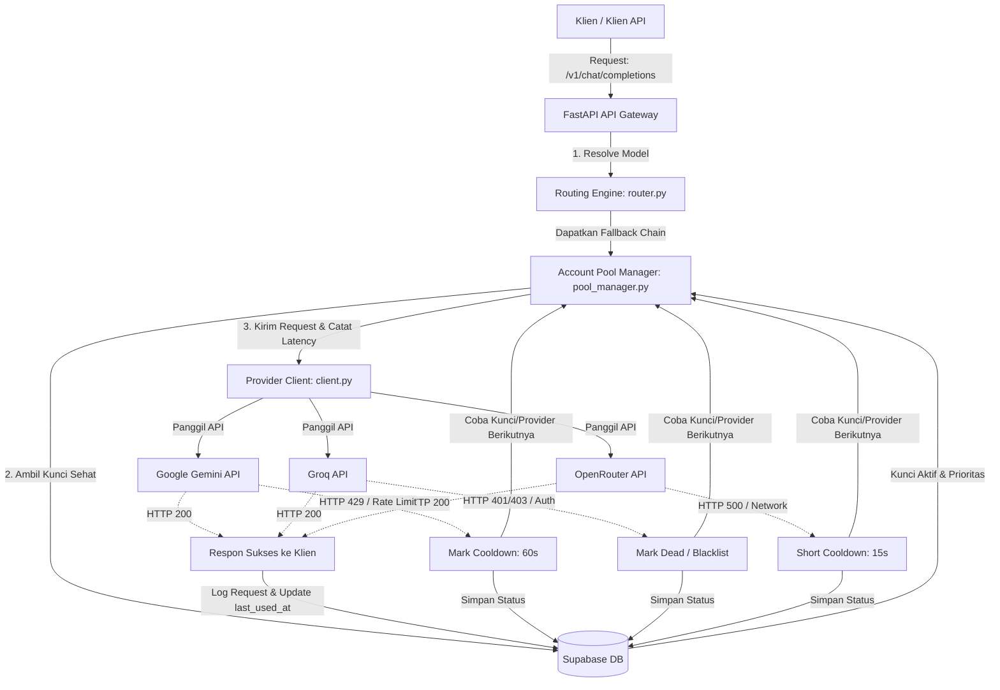

# Arsitektur Custom LLM Router

Router ini berfungsi sebagai gateway/wrapper API di antara aplikasi klien (seperti VS Code Continue, Cline, Roo Code, atau aplikasi custom) dan penyedia layanan LLM (Gemini, Groq, OpenRouter). 

Layanan ini mengelola pool akun/kunci API (*API keys*) menggunakan database **Supabase** untuk melakukan rotasi kunci otomatis (*key rotation*), pemulihan rate limit (*cooldown*), penanganan kunci mati (*blacklist*), dan fallback antar-provider.

---

## 🗺️ Diagram Aliran Request (Flowchart)



---

## 🧩 Komponen Sistem

### 1. **FastAPI API Gateway (`src/main.py`)**
* **Endpoint kompatibel dengan OpenAI**: Expose endpoint `/v1/chat/completions` (mendukung mode normal dan *streaming*) serta `/v1/models`.
* **Autentikasi Router**: Opsional menggunakan API Key sendiri (`ROUTER_API_KEY`) lewat HTTP Bearer Token.
* **Orkestrator Fallback & Retry**: Mengatur logika perulangan jika provider atau kunci mengalami kegagalan.

### 2. **Routing Engine (`src/core/router.py`)**
* **Model Virtual**: Memetakan model virtual seperti `combo-smart` dan `combo-fast` ke rantai provider & model target.
  * `combo-smart` ➔ `openrouter/anthropic/claude-3.5-sonnet` ➔ `gemini/gemini-1.5-pro`
  * `combo-fast` ➔ `groq/llama3-8b-8192` ➔ `gemini/gemini-1.5-flash`
* **Direct Fallback Mapping**: Jika klien meminta model spesifik (misal `gemini-1.5-pro`), tetap disediakan fallback alternatif (misal ke OpenRouter) jika provider utama bermasalah.
* **Heuristic Resolver**: Menentukan rantai fallback secara dinamis berdasarkan awalan nama model (prefix) jika tidak terdaftar eksplisit.

### 3. **Account Pool Manager (`src/core/pool_manager.py`)**
* **Database State**: Menggunakan Supabase sebagai *shared state* (tabel `provider_keys`). Cocok dideploy di Serverless (seperti Vercel) maupun Persistent Service (seperti Render) tanpa khawatir kehilangan status saat *cold start*.
* **Rotasi Kunci (Key Rotation)**: Mengambil kunci sehat diurutkan berdasarkan `priority` terkecil (prioritas tertinggi) dan `last_used_at` terlama (LRU - Least Recently Used / Round Robin).
* **Auto-Restoration**: Secara dinamis memulihkan kunci yang sedang dalam masa *cooldown* jika waktu cooldown-nya sudah terlewati (`cooldown_until < NOW()`) sesaat sebelum memilih kunci.
* **Log Request (`request_logs`)**: Menyimpan riwayat request termasuk token prompt, token completion, latency (ms), status code, dan pesan error jika gagal.

### 4. **Provider Client (`src/providers/client.py`)**
* **Unified API Caller**: Membungkus pemanggilan API untuk Gemini, Groq, dan OpenRouter ke dalam protokol OpenAI-compatible.
* **Stream & Non-Stream Support**: Menggunakan `httpx.AsyncClient` dengan penanganan stream generator (`aiter_bytes`) untuk respon real-time yang lancar.
* **Error Normalization**: Menerjemahkan respons non-200 menjadi `ProviderError` yang membedakan tipe error (rate-limit vs invalid auth).

---

## 🗄️ Skema Database (Supabase)

Penyimpanan state dan metrik didelegasikan penuh ke Supabase menggunakan dua tabel utama:

### A. Tabel `provider_keys`
Menyimpan daftar API key dan status operasionalnya.
* `id` (UUID, PK)
* `provider` (TEXT): `gemini`, `groq`, `openrouter`, dll.
* `key_name` (TEXT): Label pengenal kunci.
* `key_value` (TEXT): Nilai API key asli (unik).
* `status` (ENUM): `healthy`, `cooldown`, `dead`.
* `cooldown_until` (TIMESTAMPTZ): Batas waktu cooldown berakhir.
* `priority` (INTEGER): Tingkat prioritas (semakin kecil semakin diprioritaskan).
* `last_used_at` (TIMESTAMPTZ): Waktu terakhir kunci berhasil/mencoba digunakan.
* `error_count` (INTEGER): Jumlah error beruntun.

### B. Tabel `request_logs`
Menyimpan riwayat transaksi request untuk audit dan statistik.
* `id` (UUID, PK)
* `provider` (TEXT)
* `model` (TEXT)
* `key_id` (UUID, FK ke `provider_keys`)
* `prompt_tokens` (INTEGER)
* `completion_tokens` (INTEGER)
* `latency_ms` (INTEGER)
* `status_code` (INTEGER)
* `error_message` (TEXT)
* `created_at` (TIMESTAMPTZ)

---

## 🔄 Alur Penanganan Error & Pemulihan (Resiliency)

Sistem dirancang *resilient* terhadap kegagalan kunci API dengan aturan penanganan sebagai berikut:

| Jenis Error | HTTP Status | Tindakan pada Kunci | Durasi Cooldown | Alur Selanjutnya |
| :--- | :--- | :--- | :--- | :--- |
| **Rate Limit** | `429` | Pindah ke `cooldown` | 60 detik | Coba kunci berikutnya di provider yang sama. |
| **Auth/Invalid Key**| `401` / `403` | Pindah ke `dead` (blacklist) | Selamanya | Coba kunci berikutnya di provider yang sama. |
| **Network / Server Error** | `5xx` / Exception | Pindah ke `cooldown` | 15 detik | Coba kunci berikutnya di provider yang sama. |

*Catatan: Jika seluruh kunci dalam suatu provider habis/cooldown/dead, router otomatis berpindah ke provider berikutnya di dalam fallback chain.*

---

## 📁 Struktur Direktori Proyek

```
9router/
├── docs/
│   └── architectur.md          # Dokumentasi arsitektur ini
├── src/
│   ├── main.py                 # Entrypoint FastAPI & routing endpoint
│   ├── config.py               # Pemuat konfigurasi environment (.env)
│   ├── core/
│   │   ├── pool_manager.py     # Manajemen pool kunci Supabase & log request
│   │   └── router.py           # Konfigurasi model virtual & rantai fallback
│   └── providers/
│       └── client.py           # Client HTTPX untuk pemanggilan provider LLM
├── .env.example                # Template konfigurasi environment
├── render.yaml                 # Blueprint deployment ke Render
├── requirements.txt            # Dependensi Python
└── supabase_schema.sql         # Skema database Supabase
```

---

## 🚀 Perbandingan Infrastruktur Deployment

Karena kita menggunakan **Supabase** sebagai pusat manajemen state kunci API, kita terhindar dari keterbatasan serverless:

* **Vercel (Serverless)**: Sangat cocok jika ingin diekspos sebagai API tanpa beban server menyala terus-menerus. Karena status key disimpan di Supabase, masalah *cold start* tidak akan menghilangkan status rate-limit/cooldown/dead dari kunci API.
* **Render (Persistent Service)**: Bagus untuk meminimalisir waktu koneksi/cold start FastAPI itu sendiri. Render akan menjalankan server web FastAPI secara konstan.
