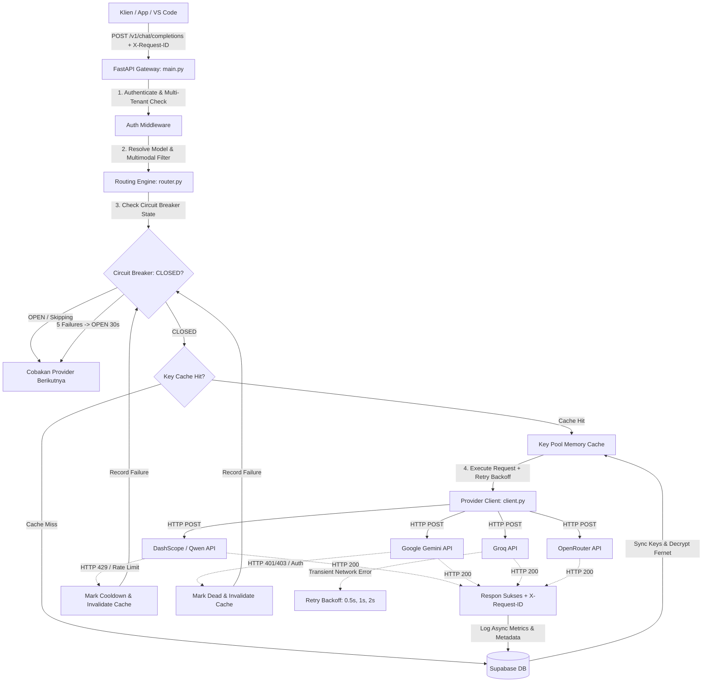

# Arsitektur Custom LLM Router v2.0

LLM Router v2.0 berfungsi sebagai **Production-Grade API Gateway** yang berada di antara aplikasi klien (VS Code extensions, chatbot, RAG pipelines, AI agents) dan berbagai provider LLM (`gemini`, `groq`, `openrouter`, `dashscope/qwen`, `openai`, `moonshot`, `mistral`, `cerebras`).

Router ini mengelola pool API Key multi-account menggunakan **Supabase** dengan caching in-memory lokal, *circuit breaker*, enkripsi *at-rest*, *multi-tenancy*, *semantic routing*, dan *fallback chain* otomatis.

---

## 🗺️ Diagram Aliran Request (Architecture Flowchart)



---

## 🧩 Komponen Sistem Utama

### 1. **FastAPI API Gateway (`src/main.py`)**
* **OpenAI-Compatible Endpoint**: Memproses `/v1/chat/completions` (normal & streaming SSE) serta `/v1/models`.
* **Request Tracing**: Menyertakan `X-Request-ID` unik di setiap request untuk kemudahan audit dan debugging.
* **Per-Request Timeout**: Memungkinkan klien menentukan timeout via header `X-Request-Timeout` atau body field `timeout`.
* **Background Task**: Menjalankan *periodic loop* setiap 30 detik untuk mengembalikan kunci cooldown yang telah habis masanya tanpa membebani request pengguna.

### 2. **Routing Engine (`src/core/router.py`)**
* **Virtual Model Presets**:
  - `combo-anti-limit`: Chain 5 provider untuk ketersediaan tinggi tanpa hambatan rate limit.
  - `combo-chatbot-cheap` / `combo-chatbot-hemat`: Chain super hemat yang memanfaatkan kuota gratis 1M token Qwen & Gemini.
  - `combo-coding-antilimit` / `combo-coding`: Chain spesialis coding (Qwen Coder ➔ DeepSeek ➔ Claude 3.5 Sonnet).
  - `combo-smart` & `combo-fast`: Preset standar untuk reasoning dan latensi rendah.
* **Semantic Multimodal Routing**: Fungsi `filter_chain_for_multimodal()` secara otomatis mendeteksi elemen `image_url` dan menyaring rantai fallback hanya ke model yang mendukung vision.

### 3. **Per-Provider Circuit Breaker (`src/core/circuit_breaker.py`)**
* **State Machine**: `CLOSED` (normal) → `OPEN` (melewati provider selama 30s) → `HALF-OPEN` (uji coba pemulihan).
* **Proteksi Cascading Failure**: Mencegah pemanggilan berulang ke provider yang sedang mengalami pemadaman total (*outage*).

### 4. **In-Memory Key Pool Cache (`src/core/key_cache.py`)**
* **Zero DB Write on Read**: Menyimpan kunci aktif per provider di memori lokal selama 30 detik (konfigurabel).
* **Instant Invalidation**: Cache otomatis dibersihkan secara presisi begitu ada kunci yang berpindah status ke `cooldown` atau `dead`.

### 5. **At-Rest Encryption (`src/core/crypto.py`)**
* **Fernet AES-128-CBC + HMAC**: Mengenkripsi seluruh API key provider sebelum disimpan ke Supabase jika `ENCRYPTION_KEY` dikonfigurasi.
* **Backward Compatible**: Menangani kunci plaintext lama secara transparan tanpa perlu migrasi manual.

### 6. **Account & Log Manager (`src/core/pool_manager.py`)**
* **Rotasi LRU & Prioritas**: Mengambil kunci berdasarkan `priority` terendah dan `last_used_at` terlama.
* **Multi-Tenant Client Keys**: Mendukung autentikasi berbasis token klien (`ck_...`) dengan verifikasi hash SHA-256 dan batasan model (*allowed_models*).

### 7. **Provider Client (`src/providers/client.py`)**
* **Connection Pooling**: Memakai `httpx.AsyncClient` dengan HTTP/2 dan batas hingga 200 koneksi simultan.
* **Transient Retries**: Retry otomatis hingga 2 kali dengan jeda *exponential backoff* (`0.5s * 2^attempt`).

---

## 🗄️ Skema Database (Supabase)

### A. Tabel `provider_keys`
Menyimpan API Key provider (terenkripsi at-rest) dan statusnya (`healthy`, `cooldown`, `dead`).

### B. Tabel `client_keys` (Multi-Tenancy)
Menyimpan hash SHA-256 dari kunci klien, batasan model, dan limit token harian.

### C. Tabel `request_logs`
Menyimpan riwayat transaksi request lengkap dengan `request_id`, `client_key_id`, token prompt/completion, latency, dan JSON `metadata`.

### D. Tabel `model_routes`
Tabel pemetaan rute dinamis yang dapat diubah langsung dari Supabase tanpa perlu *re-deploy*.

---

## 📁 Struktur Direktori Proyek

```
llm-router/
├── docs/
│   ├── architectur.md          # Dokumentasi arsitektur ini
│   ├── api_reference.md        # API reference
│   └── deployment.md           # Panduan deployment
├── src/
│   ├── main.py                 # Entrypoint FastAPI & routing pipeline
│   ├── config.py               # Konfigurasi environment & settings
│   ├── schemas.py              # Pydantic schemas (OpenAI-compatible + extensions)
│   ├── core/
│   │   ├── circuit_breaker.py  # Per-provider circuit breaker
│   │   ├── crypto.py           # At-rest Fernet encryption
│   │   ├── key_cache.py        # In-memory key pool cache
│   │   ├── logging_config.py   # Structured JSON logging
│   │   ├── pool_manager.py     # Manajemen pool Supabase & client keys
│   │   └── router.py           # Virtual models & semantic fallback chain
│   ├── providers/
│   │   └── client.py           # HTTPX async client + retry backoff
│   └── routers/
│       └── admin.py            # REST API admin management
├── tests/                      # 51 Unit & Integration tests
├── completion.md               # Summary rincian upgrade v2.0
├── requirements.txt            # Dependensi Python
└── supabase_schema.sql         # Skema database Supabase
```
